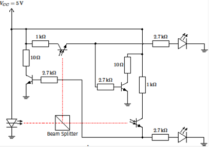
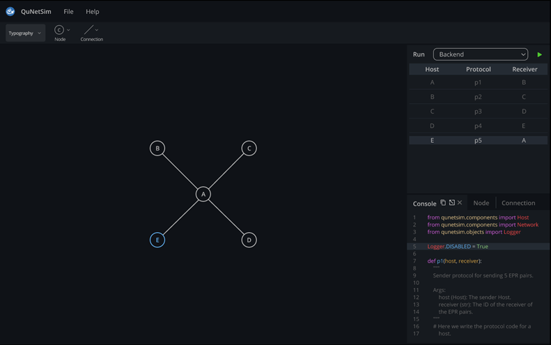

Having a somewhat unorthodox background, my introduction into the quantum computing space actually began with a TikTok video.
Like any other computer engineering student in their mid-30s stuck at home during a pandemic lockdown, the app seemed like a fun way to pass some boredom. 
I was later introduced to Unitary Fund through my participation in the [Quantum Open Source Foundation's](https://qosf.org/) Quantum [Mentorship Program](https://qosf.org/qc_mentorship/), where the project I chose to undertake was to make a meaningful contribution to Unitary Fund's error-mitigation toolkit [Mitiq](https://github.com/unitaryfund/mitiq).

## Discovering Quantum Computing

After walking across Spain trying to decide what to do with my life during the winter of 2019, I decided to move to Germany to go back to university for a career change.
I had just resolved that I would abandon a failing business venture, and the idea of going back to school to return to working on technical topics seemed like the perfect next life step for me.
My first bachelor's degree in physics was more than 12 years old, and I never actually used it.
Instead, my degree tended to just fulfil the requirement of me having a bachelor’s degree to start each job I took.

Fast-forward one tuition-free semester spent studying information engineering, and the COVID-19 pandemic was coming into its own, leading to a lot of time stuck indoors.
(For those who do not know, most university programs in Germany are tuition-free, even for foreigners, and many are in English.
I do not speak German.)
For a curious student like myself, the first lockdown was a perfect opportunity to explore my interests and get involved with whatever projects seemed like a fun way to spend my spare time.
Building keyboards and designing custom printed circuit boards (PCBs) became a special interest for a while, but it seemed to quickly get expensive.

Eventually, I stumbled upon a TikTok video talking about quantum computing.
Having heard of the topic before but not knowing much about it, I took advantage of my free time and looked into this emerging and exciting field that seemed like the perfect way to combine my earlier education in physics with my current education in information engineering.
Information engineering is a combination of computer science and electrical engineering, and it is referred to as computer engineering in many places.

Since I first started learning more about it, I have been hooked on quantum computing.
While possibly over-hyped and over-promised by the media, the future impact this field of computing will likely have remains significant.
I liken it to having the opportunity to get involved in learning about classical computing in the 1950s when computers consisted of mammoth, building-sized machines that could accomplish relatively little compared to what we now think of and associate with a computer.
But the major difference between then and now is that in the 1950s, most people did not have access to those computers.
Meanwhile today, anyone with a laptop and an internet connection can not only [learn about quantum computing](https://stem.mitre.org/quantum/), but they can even [run code on real quantum hardware for free](https://quantum-computing.ibm.com/)!

## Getting Involved with Unitary Fund

I participated in the [third cohort](https://qosf.org/mentorship_cohort_3/) of the Quantum Open Source Foundation's Quantum Mentorship Program, where my mentor Tom Lubowe suggested making a contribution to Mitiq as a good project for me.
To apply for the mentorship program, QOSF required applicants to choose a challenge from a list of options and submit their unique solution along with their application.
Consequently, I built a small, Python-based [quantum simulator](https://github.com/andre-a-alves/QOSF-Mentorship-Submission-Quantum-Simulator).
Although I had already learned to code in C and Java, that simulator was my first Python project and the vehicle by while I learned that programming language, which I have since used for several open-source contributions as well as work, school, and personal projects.

Once I started attending the weekly Mitiq meetings (every Friday at 17:00 UTC on [discord](http://discord.unitary.fund/)) to understand what was going on, I was amazed at the open and welcoming community I found at Unitary Fund.
Along with that sense of community, following along during the meetings helped me understand what were priority issues, and I decided to tackle creating [decorators for PEC](https://mitiq.readthedocs.io/en/stable/apidoc.html#mitiq.pec.pec.pec_decorator), a quantum error mitigation technique available in Mitiq.
Decorators already existed for ZNE at the time, so this task was essentially making it so users could have the same or similar options for how to implement both techniques within their programs.
In addition to that contribution, I made a few others that were mostly focused on organizing testing and improving documentation.

While I was working on my contributions to Mitiq, I found out about Unitary Fund’s [Unitary Hack 2021](https://unitaryfund.github.io/unitaryhack/) quantum hackathon and started learning about what other projects existed.
Having done a bunch of work with networking back when I was in the military, [QuNetSim](https://github.com/tqsd/QuNetSim), a quantum-enabled network simulator, caught my eye.
As part of the hackathon, I improved the template used to generate a default network, and I improved upon and expanded another hacker’s contribution to automatically generate standard topologies.

## Current Projects

I have a habit of overextending myself and getting involved in too many simultaneous projects.
Now is no different!
My current academic semester which is soon wrapping up has been spent in a full-time software engineering internship, and I thought I would have way more spare time than I have had.
As a result, my progress on my current projects is moving forward at a snail’s pace, but I slowly continue to working on them all.
My biggest problem is that everything within the field seems exciting to me, so I keep taking on additional projects before I have a chance to finish the previous one.
But with my graduation about a year away, my simple goal is to complete all of these before I earn my degree.

### Work Project

Luckily for me, I was able to find a quantum computing project within the company where I currently work, and I convinced my supervisors to assign me to it.
As a result, for the last two months of my internship, I have been tackling the conventional full-stack development behind that webapp.
While it will be made publicly available later this year, my employer is submitting a patent for the project's backend, so I cannot get into its details.
But I can say my time has been spent working with ASP.NET, C#, and Vue.js, which have all been new to me, and I am very excited for when this project is released to the public.

### Quantum Comparator Circuit / Random Number Generating

[Spooky Manufacturing](https://www.spookymanufacturing.com/) designed a [quantum random number generator](https://www.spookymanufacturing.com/QRNG/) that makes use of a laser, polarized beam splitter, photoresistors, and an Arduino-compatible microcontroller.
I loved their idea, which is based on comparing two voltage signals and choosing the higher one.
But I believe by eliminating the comparison step, which required an analog-to-digital conversion, the same thing can be done faster!
So, I had an idea to improve their design by building a quantum-based comparator circuit where phototransistors can be used in such a way where when one electrical path opens, it shorts out the other path.
I also want to use an FPGA to receive the signal, since that will be much faster than a general-purpose microcontroller.

Building this device is obviously a multi-step process, and I am currently at the circuit-proof-of-concept stage.
At this point, I have designed and conventionally simulated the circuit.
When I get back home in mid-February, I will order the necessary components, build it, and test it out.
If the circuit works as I imagine, the next step will be to program an FPGA to work with the incoming signal.
The final step will be to put it all on a small printed circuit board (PCB) that can interact with another electrical device, hopefully by USB.
Depending upon a number of factors, I am considering approaching some of my professors with this idea as the basis for a bachelor’s thesis project later this year.

As an aside, drawing the circuit using [CircuiTikZ](https://github.com/circuitikz/circuitikz) required creating a laser diode component, since that was not part of the package, yet.
The component is now a part of the official CircuiTikZ release.

### Study Bank for Qiskit Certification Test

Anyone who has spent some time in the quantum computing space has surely come across [Qiskit](https://qiskit.org/), IBM’s open-source quantum computing software development kit.
I recently became an [IBM Certified Associate Developer – Quantum Computation using Qiskit v0.2X](https://www.ibm.com/training/certification/C0010300), which obviously required studying.
Along with a more thorough study guide, IBM published a 20-question sample test, but while the question bank provides a list of correct answers, it does not offer any explanations for those answers.
So as a study aid for myself, I created a JupyterLab [answer bank](https://github.com/andre-a-alves/qiskit-sample-test-answers) for that sample test.
The JupyterLab not only gives the correct answer, but it also explains each question, explains why each potential answer is right or wrong, and provides links to references for each question.
I hope to improve the explanations and references with time, as well as potentially expand the lab and add more questions

### QuNetSim Graphical User Interface

During Unitary Hack 2021, there was an open issue tied to a bounty that involved creating a user interface for QuNetSim.
I got in touch with QuNetSim’s creator and Unitary Fund micrograntee [Stephen DiAdamo](https://scholar.google.ca/citations?user=k9O1vSwAAAAJ&hl=en) about what he had in mind for such an interface.
While it was outside the scope of what I could accomplish during the hackathon, I pitched my friend and UI/UX designer [Frances Poblete](http://francespoblete.com) to help design the UI, and she agreed.
Her design looks great, and the prototype will form the basis for building the UI.

While I have not found the time to dedicate to improving my front-end development skills during this last semester, I still plan to be a major contributor to this UI as it gets built later this year.

    Stay up to date with what Andre is working on by following him on <a href="https://github.com/andre-a-alves" target="_blank">GitHub</a> and <a href="https://www.linkedin.com/in/andre-a-alves/" target="_blank">LinkedIn</a>!

